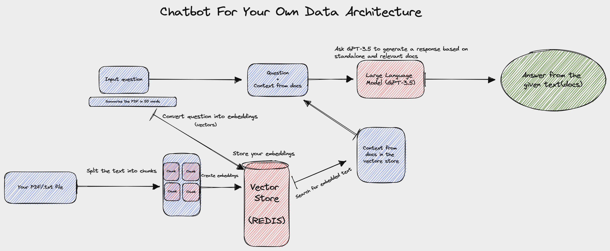

# Q&A Chatbot for PDF Documents

<p align="center">
  
</p>

This repository contains a Streamlit application that utilizes the power of LangChain and OpenAI's language model to provide a conversational Q&A chatbot. Users can upload a PDF document, and the chatbot will answer questions about the document's content.

## Table of Contents

- [Q\&A Chatbot for PDF Documents](#qa-chatbot-for-pdf-documents)
  - [Table of Contents](#table-of-contents)
  - [Installation](#installation)
  - [Usage](#usage)
  - [Architecture](#architecture)
  - [Contributing](#contributing)
  - [License](#license)
  - [Contact](#contact)

## Installation

Before starting, make sure you have Python 3.8+ installed. To run the Q&A Chatbot, follow these steps:

1. Clone this repository:

   ```
   git clone https://github.com/mrzaid/Chatbot-for-PDF.git
   cd Chatbot-for-PDF
   ```

2. Install the necessary libraries:

   ```
   pip install -r requirements.txt
   ```

## Usage

To use this application:

1. Obtain an OpenAI API key.

`Do not expose this key publicly.`

After obtaining your OpenAI API key, create a `.env` file in the root of your project directory.

2. Add the following line to the `.env` file:

   ```
   OPENAI_API_KEY=your_openai_api_key
   ```

   Replace `your_openai_api_key` with your actual OpenAI API key.

3. The application is set to automatically load environment variables from the `.env` file.

4. Run the application:

   ```
   streamlit run app.py
   ```

5. Open the Streamlit interface in your web browser.

6. Upload a PDF file and ask questions about its content. The chatbot will generate answers based on the document's content.

## Architecture



The chatbot works in several steps:

1. **Upload PDF**: You upload the desired PDF file that you want to ask questions about.

2. **Text Extraction**: The bot uses the PyPDF2 library to read the PDF file and extract text from it.

3. **Text Splitting**: The bot then splits the text into smaller chunks to overcome token limit issue and understand the content.

4. **Embeddings Creation**: Using OpenAIEmbeddings, the bot creates text embeddings from the chunks.

5. **Document Search Creation**: The bot then uses these embeddings to create a document search via the FAISS vectorstore.

6. **Conversational Chain Creation**: A LangChain ConversationalRetrievalChain is created using the OpenAI model and the document retriever.

7. **User Query**: Finally, you enter your query. The bot will provide a response based on the contents of the uploaded PDF, also citing the source sections from the PDF.

## Contributing

Contributions are welcome! To contribute, please follow these steps:

1. Fork the repository.
2. Create a new branch: `git checkout -b your-branch-name`.
3. Make your changes and commit: `git commit -m 'Add some feature'`.
4. Push to the branch: `git push origin your-branch-name`.
5. Create a pull request.

For larger changes, please open an issue first to discuss what you would like to add.

## License

This project is licensed under the MIT License. See `LICENSE` for more details.

## Contact

For more information, feel free to reach out!

- Muhammad Zaid Ahmed
- Email: m.zaidahmed861@gmail.com
- Twitter: https://twitter.com/mrzaid
- LinkedIn:https://www.linkedin.com/in/muhammad-zaid-ahmed/
